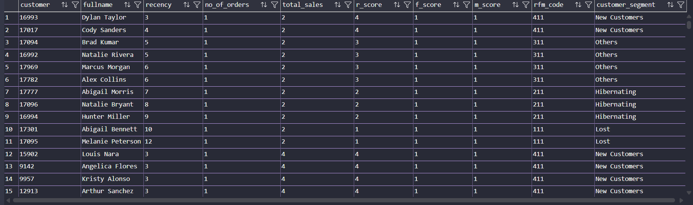
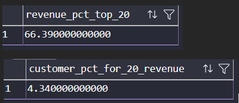
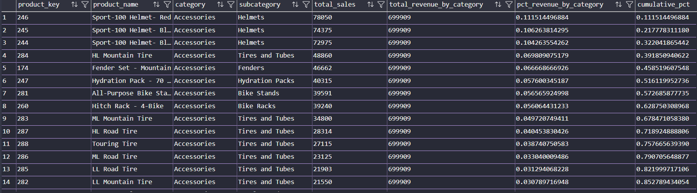
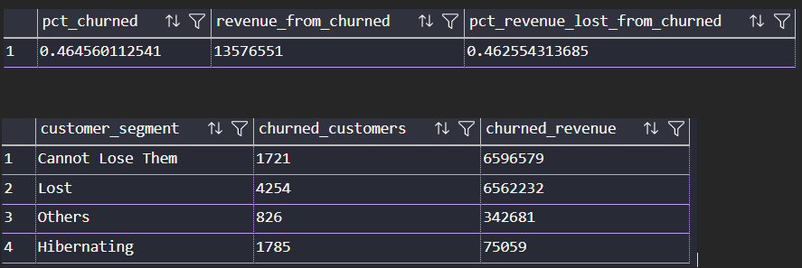
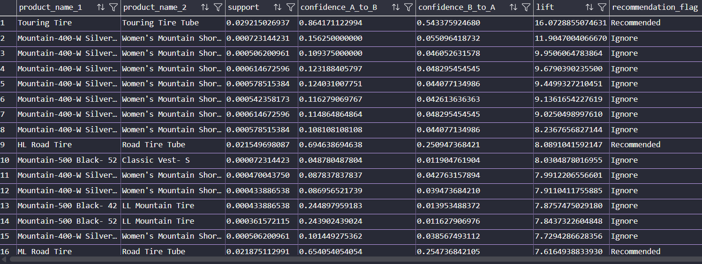
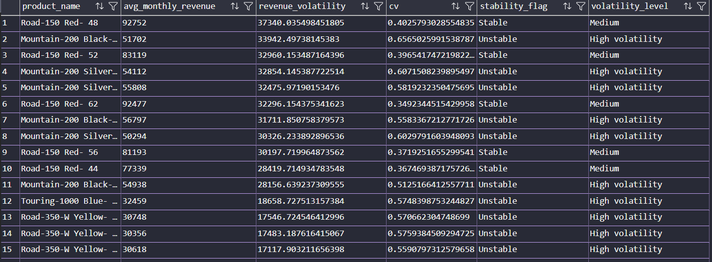

# 📊 E-commerce Customer & Revenue Analysis (SQL Case Study)

## 🧠 Project Overview

This project analyzes an e-commerce dataset using advanced SQL techniques to uncover insights related to customer behavior, revenue distribution, product performance, and business risk.

The goal is to simulate a real-world business scenario where SQL is used not just for querying data, but for generating actionable insights that can support decision-making.

---

## 🚀 How to Run This Project

1. Clone the repository

2. Open SQL Server (SSMS or VS Code)

3. Run the initialization script:
   scripts/00_init_database.sql

4. Update BULK INSERT file paths to match your local system

5. Run analysis queries:
   scripts/01 to 13

---

## ⚠️ Data Loading Note

The BULK INSERT paths in the initialization script are configured 
for a local environment.

Before running the script, update file paths accordingly.

Example:
C:\your_path\datasets\flat-files\dim_customers.csv

Also ensure SQL Server has permission to access the specified directory.

---

## 🎯 Objectives

- Identify high-value and loyal customers
- Analyze revenue concentration and customer contribution
- Understand customer retention and lifecycle patterns
- Evaluate product performance and sales trends
- Detect churn risks and inventory inefficiencies
- Explore product relationships for cross-selling opportunities

---

## 📂 Data Source & Acknowledgment

This project uses datasets and base structure from:

**DataWithBaraa – SQL Data Analytics Project**

The original project demonstrates foundational SQL data modeling 
and warehouse design (bronze → silver → gold layers).

Enhancements in this project include:
- Development of 13 business-focused analytical queries
- Use of advanced SQL techniques (window functions, cohort analysis, etc.)
- Modification of reporting logic (replacing GETDATE() with a fixed reference date)
  to ensure consistency with historical data

---

## 📊 Key Analyses Performed

### Customer Segmentation (RFM Analysis)

- Used `CUME_DIST()` instead of NTILE for more accurate distribution-based scoring
- Segmented customers into groups like Champions, Loyal, At Risk, etc.
- Focused on interpreting recency as a dominant behavioral signal

---

### Revenue Concentration (Pareto Analysis)

- Identified contribution of top 20% customers
- Found that a small percentage of customers drive a large share of revenue
- Highlighted existence of a high-value core customer base

- Ranked products using `ROW_NUMBER()` and `CROSS APPLY`
- Identified top-performing products per category and subcategory

---

### Monthly Sales Trend

- Analyzed month-over-month growth using window functions
- Used `LAG()` to calculate growth rates
- Identified seasonality and trend shifts

---

### Churn Analysis

- Identified churned customers using recency thresholds
- Calculated percentage of customers lost and associated revenue impact
- Optimized query using conditional aggregation

---

### Basket Analysis (Lite)

- Identified frequently purchased product pairs
- Calculated Support, Confidence, and Lift
- Highlighted cross-selling opportunities

---

### Product Revenue Volatility

- Measured stability using standard deviation and coefficient of variation
- Classified products into stable vs volatile categories

---

## 🔍 Key Insights

- High-value customers can be identified early using RFM segmentation, enabling targeted retention strategies
- Top 20% of customers contribute a disproportionate share of total revenue, confirming a strong Pareto distribution
- Revenue is heavily concentrated in a small subset of products, indicating potential dependency risk
- Customer churn significantly impacts both revenue and long-term growth potential
- Product associations reveal cross-selling opportunities for increasing average order value
- Revenue volatility highlights demand instability in certain product categories

---

## 📸 Sample Outputs

Query results were validated using SQL Server.

Key outputs (screenshots) are available in the `outputs/` folder, 
highlighting:
- Customer segmentation results
- Revenue concentration patterns
- Cohort retention trends
- Product performance rankings

---

## 🛠️ SQL Techniques Used

- Window Functions (`CUME_DIST`, `LAG`, `RANK`, `ROW_NUMBER`)
- Common Table Expressions (CTEs)
- Conditional Aggregation
- CROSS APPLY
- Percentile Functions (`PERCENTILE_CONT`)
- Analytical Metrics (RFM, LTV, Retention, Pareto)

---

## 🚀 Future Improvements

- Build an interactive Power BI dashboard
- Automate analysis using stored procedures
- Extend basket analysis into recommendation system logic
- Add time-series forecasting for revenue trends
