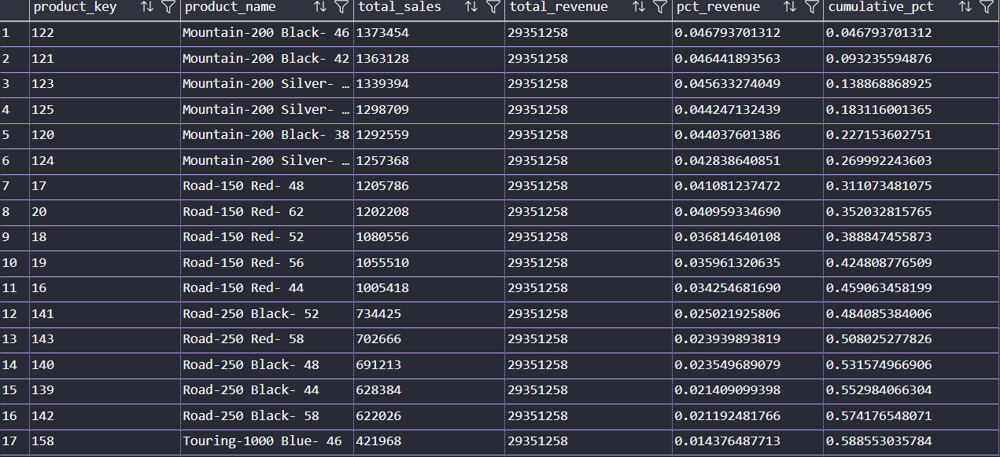

# 📊 E-commerce Customer & Revenue Analysis (SQL Case Study)

## 🧠 Project Overview

This project analyzes an e-commerce dataset using advanced SQL techniques and Excel-based visualizations to uncover actionable business insights related to customer behavior, revenue distribution, product performance, and business risk.

The goal is to simulate a real-world business scenario where SQL is used not just for querying data, but for generating actionable insights that can support decision-making.

📌 Note: All visualizations were created in Excel using structured outputs from SQL queries to simulate real-world analyst workflows.

---

## 🚀 How to Run This Project

1. Clone the repository

2. Open SQL Server (SSMS or VS Code)

3. Run the initialization script:
   scripts/00_init_database.sql

4. Update BULK INSERT file paths to match your local system

5. Run analysis queries:
   scripts/01 to 13

---

## ⚠️ Data Loading Note

The BULK INSERT paths in the initialization script are configured 
for a local environment.

Before running the script, update file paths accordingly.

Example:
C:\your_path\datasets\flat-files\dim_customers.csv

Also ensure SQL Server has permission to access the specified directory.

---

## 🎯 Objectives

- Identify high-value and loyal customers
- Analyze revenue concentration and customer contribution
- Understand customer retention and lifecycle patterns
- Evaluate product performance and sales trends
- Detect churn risks and inventory inefficiencies
- Explore product relationships for cross-selling opportunities

---

## 📂 Data Source & Acknowledgment

This project uses datasets and base structure from:

**DataWithBaraa – SQL Data Analytics Project**

The original project demonstrates foundational SQL data modeling 
and warehouse design (bronze → silver → gold layers).

Enhancements in this project include:
- Development of 13 business-focused analytical queries
- Use of advanced SQL techniques (window functions, cohort analysis, etc.)
- Modification of reporting logic (replacing GETDATE() with a fixed reference date)
  to ensure consistency with historical data

---

## 📊 Key Analyses Performed

### Customer Segmentation (RFM Analysis)

- Used `CUME_DIST()` instead of NTILE for more accurate distribution-based scoring
- Segmented customers into groups like Champions, Loyal, At Risk, etc.
- Focused on interpreting recency as a dominant behavioral signal

---

### Revenue Concentration (Pareto Analysis)

- Identified contribution of top 20% customers
- Found that a small percentage of customers drive a large share of revenue
- Highlighted existence of a high-value core customer base

- Ranked products using `ROW_NUMBER()` and `CROSS APPLY`
- Identified top-performing products per category and subcategory

---

### Monthly Sales Trend

- Analyzed month-over-month growth using window functions
- Used `LAG()` to calculate growth rates
- Identified seasonality and trend shifts

---

### Churn Analysis

- Identified churned customers using recency thresholds
- Calculated percentage of customers lost and associated revenue impact
- Optimized query using conditional aggregation

---

### Basket Analysis (Lite)

- Identified frequently purchased product pairs
- Calculated Support, Confidence, and Lift
- Highlighted cross-selling opportunities

---

### Product Revenue Volatility

- Measured stability using standard deviation and coefficient of variation
- Classified products into stable vs volatile categories

---

## 🔍 Key Insights

- Customer value is highly concentrated, with a small segment contributing disproportionately to total revenue (long-tail distribution)
- High-value customers can be identified early using RFM segmentation, enabling targeted retention strategies
- Revenue growth accelerated significantly in 2013, supported by consistent upward trends in rolling averages
- Churn impact is driven more by customer value than volume, with high-value segments posing the greatest risk
- Product revenue follows a Pareto distribution, with a small subset driving the majority of sales
- Product associations reveal strong cross-selling opportunities that can increase average order value
- Revenue volatility varies across products, highlighting stability differences and inventory planning implications

---

## 📊 Data Visualization

Query results were exported to Excel and visualized using appropriate chart types to enhance interpretability and communicate business insights effectively.

Each visualization is built directly from SQL outputs, ensuring analytical accuracy while improving storytelling.

---

### 🧠 Customer Segmentation (RFM Analysis)

- Customers are distributed across segments such as Lost, New, High Potential, and Cannot Lose Them
- A significant portion falls into churn-risk categories, indicating retention opportunities

---

### 📈 Monthly Sales Trend & Growth

- Sales remained stable during 2011–2012 and entered a strong growth phase in 2013
- A 3-month rolling average was used to smooth volatility and reveal underlying trends
- MoM growth highlights fluctuations during expansion phases

---

### 📉 Customer Lifetime Value Distribution (Long-Tail)

- Customer value follows a long-tail distribution
- A small group of customers contributes disproportionately high value
- Majority of customers fall into low-value segment

---

### 🔄 Customer Retention Distribution

- High retention group dominates the customer base
- Clear segmentation between high and low retention cohorts
- Indicates opportunities to convert medium/low retention users

---

### ⚠️ Customer Churn Impact

- “Cannot Lose Them” segment contributes highest revenue loss despite fewer customers
- Churn impact is not volume-driven but value-driven
- Highlights need for targeted retention strategies

---

### 📊 Product Revenue Concentration (Pareto)

- Top products contribute ~80% of total revenue
- Strong Pareto effect indicates revenue concentration risk
- Enables prioritization of high-impact products

---

### 📉 Product Revenue vs Volatility

- High-revenue products tend to be more stable
- Low-revenue products show higher volatility
- Helps identify reliable vs risky product segments

---

### 🛒 Product Associations (Basket Analysis)

- Strong product pairings identified using lift score
- Highlights cross-selling opportunities
- Useful for recommendation strategies

---

## 🛠️ SQL Techniques Used

- Window Functions (`CUME_DIST`, `LAG`, `RANK`, `ROW_NUMBER`)
- Common Table Expressions (CTEs)
- Conditional Aggregation
- CROSS APPLY
- Percentile Functions (`PERCENTILE_CONT`)
- Analytical Metrics (RFM, LTV, Retention, Pareto)

---

## 🚀 Future Improvements

- Build an interactive Power BI dashboard
- Automate analysis using stored procedures
- Extend basket analysis into recommendation system logic
- Add time-series forecasting for revenue trends
